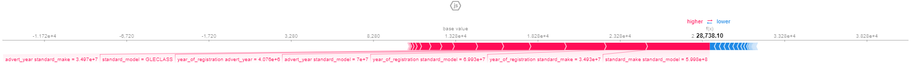

# Table of Content
- [Table of Content](#table-of-content)
- [**1. Data Processing for Machine Learning** ](#1-data-processing-for-machine-learning-)
    - [**Dealing with missing values**](#dealing-with-missing-values)
    - [**Dealing with Outliers and Noise**](#dealing-with-outliers-and-noise)
    - [**Categorical Encoding**](#categorical-encoding)
    - [**Sampling and Splitting**](#sampling-and-splitting)
- [**2. Feature Engineering** ](#2-feature-engineering-)
- [**3. Feature Selection and  Dimensionality Reduction** ](#3-feature-selection-and--dimensionality-reduction-)
- [**4. Model Building** ](#4-model-building-)
    - [**4.1 A Linear Model** ](#41-a-linear-model-)
    - [**4.2 A RandomForest Model** ](#42-a-randomforest-model-)
    - [**4.3 A Boostred Tree (CatboostRegressor) Model** ](#43-a-boostred-tree-catboostregressor-model-)
    - [**4.1 A Voter Ensemble (VotingRegressor) Model** ](#41-a-voter-ensemble-votingregressor-model-)
- [**5. Model Evaluation and Analysis** ](#5-model-evaluation-and-analysis-)
    - [**5.1 Overall Performance with Cross-Validation** ](#51-overall-performance-with-cross-validation-)
    - [**5.2 True vs Predicted Analysis** ](#52-true-vs-predicted-analysis-)
    - [**5.3 Global and Local Explanations with SHAP** ](#53-global-and-local-explanations-with-shap-)
    - [**5.4 Partial Dependency Plots** ](#54-partial-dependency-plots-)

<br />
<br /> 
<br />
<br />
<br />
<br />
<br />
<br />


# **1. Data Processing for Machine Learning** <a name="DataUnderstanding"></a>
The dataset contains an anonymised collection of adverts with information on vehicles such as brand, type, colour, mileage, as well as the selling price.
There are 402,005 rows and 12 columns. 
 
### **Dealing with missing values**   
Dealt with missing values in the `Year_of_registration` and `Reg_Code` columns by scraping the UK's car registration codes for age and year identifiers tables from the Wikipedia page [UK Vehicle Registration Codes](https://en.wikipedia.org/wiki/Vehicle_registration_plates_of_the_United_Kingdom) and mapping the reg_code to fill in the missing year of registration. For every ***NEW*** car, there's no year of registration and reg_code attached to it. This is because it hasn't been purchased and registered by any user. So, I filled the missing `Year_of_registration` for **NEW** cars with ***2020*** and `Reg_Code` for ***NEW*** cars with ***20***. This is because the maximum `year_of_registration` in the dataset is 2020 and also the **Public_reference** column indicates the year, month, and day the advert was made, this also aids in my decision to use ***2020*** as the year of registration for new cars.
   
For `body_type`, `fuel_type` and `standard_colour`, missing values were detected and was handled using **`groupby()`** method. Below is the function used to do that:
```c
    def fillna_with_mode(missing_col):
        df[missing_col] = df.groupby(['standard_make', 'standard_model'])[missing_col].apply(lambda x: x.fillna(scipy.stats.mode(x)[0][0]))
        return df
       
    def refillna_with_mode(missing_col):
        missing_values = df[df[missing_col].isnull()]
        brand_model = missing_values[['standard_make','standard_model']]

        results = []
        for i, j in brand_model.iterrows():
            try:
                result = (df[(df['standard_make']==j['standard_make']) & (df['standard_model']==j['standard_model'])][missing_col]
                .value_counts().sort_values(ascending=False).index[0])
                results.append(result)
            except IndexError:
                results.append("no value")
        brand_model[missing_col] = results
        return brand_model
```

 
### **Dealing with Outliers and Noise**
For `Mileage`, I capped outliers for values greater than 200,000mph and replaced the outliers with value at 200,000mph.

For `price`, most of the top outliers in the price feature are expensive and luxurious cars, with most of them having low mileage. Handling the outliers in price was a tricky one. The car prices classified as outliers are actually expensive cars. For the purpose of this project, I excluded these expensive cars. I handled outliers for each subsets of vehicle conditions, capping the quantiles at different values.
<!-- <p style="text-align:center;">
    
</p>
<p style="text-align:center">
    <font size="1">
        <i>Fig.6 Boxplots After Dealing with Outliers</i>
    </font>
</p> -->

### **Categorical Encoding**
Before encoding, For `standard_colour` column, categories that had count less than 200 were grouped into a new category:`Other_standard_colour`. `body_type` categories with the word ***van*** were all grouped together into a new category: `Vans`. Features with extremely high cardinality, such as `standard_make` and `standard_model`, `TargetEncoder()` was used. For Other features like `standard_colour`, `fuel_type`, `vehicle_condition`, and `body_type` were encoded using `OneHotEncoder()`.

### **Sampling and Splitting**
***10%*** of the preprocessed data was sampled and then splitted into features and target. Features that had perfect correlation with each other were dropped before splitting.

# **2. Feature Engineering** <a name="engineering"></a>
A critical look at the `Public_reference` column shows the year, month, day, and some ID of each advert. I created a new column; `advert_year` by grabbing the first 4 digits from the `public_reference` column.
``` json
adverts['advert_year'] = adverts['public_reference'].astype(str).str[:4].astype('int64')
```
`Vehicle_age` column was created by subtracting the `Year_of_registration` from the `advert_year`. A third column was created for `Avg_miles_per_year` by dividing the `mileage` by the `vehicle_age`.

A function was defined to reduce infrequent categories in `standard_colour` and `body_type`. For `standard_colour`, categories with value counts less than ***100*** were grouped into new category called: **`Other_standard_colour`**. For `body_type`, cars that have ***'vans'*** in their names were grouped together into a new category called: ***Vans***.

Also, automated feature engineering was used to derive extra features. `PolynomialFeatures` a library from scikit-learn is a feature engineering technique that creates polynomial and interaction features from the original features. Polynomial and interaction features can help capture  nonlinear relationships between features. However, interactions only was used (`interaction_only=True`) without setting a polynomial degree. Scaling was done after polynomial features.

Below is the preprocessing pipeline function:
```c
def preprocessor_pipe():
    numeric_features = ['mileage','year_of_registration','avg_miles_per_year','advert_year','standard_make','standard_model']
    numeric_transformer = Pipeline(
        steps=[
            # its a good practice to do the polynomial/interaction feature generation before scaling.
            ("poly_int", PolynomialFeatures(interaction_only=True, include_bias=False)),
            ("scaler", StandardScaler())
        ]
    ).set_output(transform='pandas')

    categorical_features = ['standard_colour','vehicle_condition','body_type','fuel_type']
    categorical_transformer = Pipeline(
        steps=[
            ("ohe", OneHotEncoder(handle_unknown="infrequent_if_exist", sparse_output=False, drop='if_binary')),
        ]
    ).set_output(transform='pandas')

    preprocessor = ColumnTransformer(
        transformers=[
            ("num", numeric_transformer, numeric_features),
            ("cat", categorical_transformer, categorical_features),
        ],
        remainder='passthrough',
        verbose_feature_names_out=False
    ).set_output(transform="pandas")

    return preprocessor
```

<br />
<br />
<br />
<br />

# **3. Feature Selection and  Dimensionality Reduction** <a name="building"></a>
There are several feature selection techniques, however, to gauge the feature importance, the novel correlation coefficient, ϕK's was used  so because it is suitable for data sets with mixed variable types, e.g. where some variables are categorical. 

We can anticipate one variable from another if the two are correlated. As a result, if two features are correlated, the model only actually requires one of them as the other does not provide any new information. Some features have a perfect correlation with each other. These features were dropped when selecting features for predictions.

**Dimensionality Reduction using Principal Component Analysis(PCA)**

All numerical columns were scaled before fitting the PCA. **[`n_components=0.95%`]**: This will select the number of components required while preserving 95% of the variablitiy in the data. 11 PCA components were selected. 

Model results on PCA components as features

|model|	train_score|	RMSE|	r2_score|	time_taken|
|---|---|----|----|----|
|random_forest|	0.981672|	3122.792897|	0.875781|	58.065151|
|catboost|	0.916602|	3151.395020|	0.873495|	4.825241|
|ridge|	0.720192|	4683.381777|	0.720604|	0.047892|

**Automated Feature Selection Using Recursive Feature Elimination with Cross-Validation (RFECV)**

RFECV starts by training a model using all the features and then evaluates their impact on the model's performance. Based on this evaluation, the least important feature(s) are eliminated. It can effectively select the most relevant features, improving model performance, reducing complexity, and enhancing interpretability.
`Ridge()` model was used beacuase it incorporates a regularization term to prevent overfitting and a cross validation of 10 folds.
```c
model = Ridge()
ref_selector = RFECV(model, step=1, cv=10)
```
***44*** features were selected by using this method. 

Model results on using features generated by RFECV:
|model|	train_score|	RMSE|	r2_score|	time_taken|
|---|---|---|---|---|
|catboost|	0.942482|	2467.869402|	0.922421|	4.660323|
|random_forest|	0.986344|	2655.720849|	0.910161|	42.356767|
|linear_regression|	0.800567|	3988.251283|	0.797388|	0.086370|

**Automated Feature Selection Using SelectKBest, f_regression**

The number of important features gotten by using RFECV was used as a guide in selecting a number for K in SelectKBest algorithm. 
```c
selector = SelectKBest(f_regression, k=44).fit(X_train_preprocessed, y_train)
```


Model results on using features generated by using SelectKBest features.
|model|	train_score|	RMSE|	r2_score|	time_taken|
|---|--|--|--|--|
|catboost|	0.942906|	2444.389268|	0.923890|	7.091618|
|random_forest|	0.986335|	2660.952518|	0.909807|	52.939820|
|linear_regression|	0.800805|	3978.411474|	0.798386|	0.095953|

# **4. Model Building** <a name='buidling'></a>
In this section, I built 4 regression models. Top features generated by `SelectKBest` was used across all models.  
### **4.1 A Linear Model** <a name='linear'></a>
After hyperparameter tunning, table below holds the results: 
|model|	train_score|	RMSE|	r2_score|	
|---|--|--|--|
|LinearRegression|0.801|	3978.411|	0.798|

The linear regression model achieved a training score of **80.1%**. The RMSE value of **3978.411** suggests that the model's predictions are on average off by **£3978.411**. The R-squared value of the model is **0.798**, i.e **79.8%**. This value is very close to the training score which implies that the model achieved a good balance between learning from the training data and generalizing to test data.

### **4.2 A RandomForest Model** <a name='random'></a>
After hyperparameter tunning, table below holds the results: 
|model|	train_score|	RMSE|	r2_score|	
|---|--|--|--|
|RandomForest|0.966|	2678.537|	0.909|

The RandomForest regression model achieved a training score of **96.6%**. The RMSE value of **2678.537** suggests that the model's predictions are on average off by **£2678.537**. The R-squared value of the model is **0.909**, i.e **90.9%**. The model performs very well on the training data, achieving a high level of accuracy. However, there is a slight drop in performance when evaluating the model on test data. A 6% drop from the training score to the test score indicates a certain degree of overfitting. 


### **4.3 A Boostred Tree (CatboostRegressor) Model** <a name='catboost'></a>
After hyperparameter tunning, table below holds the results: 
|model|	train_score|	RMSE|	r2_score|	
|---|--|--|--|
|Catboost|0.975|	2344.412|	0.930|

The Catboost regression model achieved a training score of **97.5%**. The RMSE value of **2344.412** suggests that the model's predictions are on average off by **£2344.412**. The R-squared value of the model is **0.930**, i.e **93.0%**. The model performs exceptionally well on the training data, achieving a high level of accuracy. There is still a slight drop in performance when evaluating the model on test data, but the difference is relatively small, suggesting that the model generalizes well. With a 4.5% drop from the train score to the test score, the model shows some signs of overfitting, although the magnitude of overfitting is relatively modest. 


### **4.1 A Voter Ensemble (VotingRegressor) Model** <a name='vote'></a>
After hyperparameter tunning, table below holds the results: 
|model|	train_score|	RMSE|	r2_score|	
|---|--|--|--|
|Ensemble(lr+rf+cat)|0.946|	2688.474|	0.908|
|Ensemble(rf+cat)|0.973|	2433.62|	0.925|

The Voting Regressor model  with all models(LinearRegression,RandomForest, and Catboost)
achieved a training score of **94.6%**. The RMSE value of **2688.474** suggests that the model's predictions are on average off by **£2688.474**. The R-squared value of the model is **0.908**, i.e **90.8%**. The model performs exceptionally well on the training data, achieving a high level of accuracy. There is still a slight drop in performance when evaluating the model on test data, but the difference is relatively small, suggesting that the model generalizes well. With a 3.8% drop from the train score to the test score, the model shows some signs of overfitting, although the magnitude of overfitting is relatively modest.

However, Voting Regressor model  with RandomForest and Catboost
achieved a training score of **97.3%**. The RMSE value of **2433.62** suggests that the model's predictions are on average off by **£2433.62**. The R-squared value of the model is **0.925**, i.e **92.5%**. This Ensemble actually performed than ensemble(lr+rf+cat) interms of accuracy and loss metrics. In the ensemble(lr+rf+cat), the Linear Model actually pulls down the accuracy and increases the loss metrics.

<p style="text-align:center;">
    >
</p>
<p style="text-align:center;">
    >
</p>
<p style="text-align:center">
    <font size="1">
        <i>Fig.1 Model predicitons vs Actual Price</i>
    </font>
</p>


# **5. Model Evaluation and Analysis** <a name="evaluation"></a>
### **5.1 Overall Performance with Cross-Validation** <a name="overall"></a>
Cross Validation was done to assess the performacne of models and see our it generalises on different data. It is important to cross validate our results so as to check if the models are not overfitting. 

The cross validation scores for each model was achieved on a 5 k-Fold splits which means when the data was splitted into 5 equal folds. Below is a table showing the RMSE value of each model used:

| |LinearRegression(lr)|RandomForest(rf)|CatBoost(cat)| Ensemble(lr+rf+cat)|Ensemble(rf+cat)|
|:------:| :---:|:----: | :---|:----: | :---:|
|CrossValidation(RMSE)|3977.507|2650.346|**2366.853**|2690.194|2424.932

Based on the provided cross-validation(RMSE) values, the CatBoost model has the lowest RMSE value of 2366.853. Catboost Regression model has the best overall model performance, i.e highest accuracy score, lowest mean root mean squared error.

### **5.2 True vs Predicted Analysis** <a name="true"></a>
The purpose of comparig true and predicted prices is to actually assess the model performance. To calculate the residuals, the difference bteween the true prices and predicted prices. The RMSE is one of the metrics that can be used.

<p style="text-align:center;">
    
</p>
<p style="text-align:center">
    <font size="1">
        <i>Fig.2 True price vs Predicted price</i>
    </font>
</p>

The plot above show the relationship between the true price and predicted prices. The model predicts well enough for the low priced car, as the prices increases, the residuals get larger and this might be due to some reasons. The model may not have access to important features or information that could influence the target variable.  The model might not have been exposed to enough diverse examples with higher target values during the training process. Insufficient representation of high-value instances can lead to the model's inability to accurately predict such values.


### **5.3 Global and Local Explanations with SHAP** <a name="shap"></a>
- **Global Explanantions with SHAP**
<p style="text-align:center;">
     <!--alt="Logo" width="3500" height="300"> -->
</p>

Above are the important features of the model used. It is not surprising to see `year_of_registration` and `milage` among top 10 important features. Polynomial engineered features happens to be among the top 3 features, `year_of_registraion` being the common feature in all interactions. One would expect that the feature; `year_of_registration standard_make` and `year_of_registration standard_model` should determine the price of car.. Other features were genrerated after processing through encoding. It's not surprising that `year_of _registration`,`standard_make`, `standard_model`, and `vehicle_condition` are really good predictors of price. 

- **Local Explanantions with SHAP**
<p style="text-align:center;">
    
</p>

In plot above, The predicted price is £28,738.10 and the actual price is £29,995. The feature contributing the most to the price of this Vehicle is the `standard_make standard_model` feature which conrtibuted  drastically to the price of the car. The car is a Mercedes-Benz GLEclass. Other contributing features are `year_of_registration standard_make` and `year_of_registration standard_model`. However, the `mileage` and some interactions with `mileage` contributed to the reduction in the price of the car.

Let's check one more individual prediction;
<p style="text-align:center;">
    
</p>


In the plot above, the vehicle is a Skoda Radpidspaceback. The feature contributing the most to the price of this Vehicle is the `year_of_registration advert_year` feature which are 2017 and 2020 respectively, which conrtibuted  drastically to the price of the car. Other contributing feature is `mielage advert_year`. The car has a low milage of about 31,000mph. However, the `standard_make standard_model`, `standad_colour` is silver, and the `year_of_registration standard_model` contributed to the reduction in the price of the car.


### **5.4 Partial Dependency Plots** <a name="partial"></a>
Partial Dependency Plot (PDP) is a technique used to visualize the relationship between a target variable and a set of predictor variables in a It can show whether the relationship between target and a feature is linear, monotonic, or more complex[1]. It helps in understanding how the predicted outcome changes with variations in the values of specific features, while keeping all other features constant. 

Two features were selected `years_of_registration` and `mileage`. The selection of these features is based on their importance in the model.  
<p style="text-align:center;">
    
</p>
<p style="text-align:center;">
    
</p>


As the `year_of_registration` increases, the model predicts on average high car prices. potential buyers and seller can actually have any idea of how much a car will cost my knowing the yeart of registration of the car. In addition, the higher the `mileage`,  the lesser the price of a car, which makes sense. Interestingly, the `year_of_registration` and `mileage` have an effect on the price of a vehicle whether the vehicle is new or used.

**References**

[1]. https://christophm.github.io/interpretable-ml-book/pdp.html